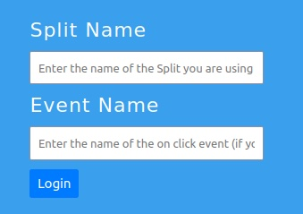
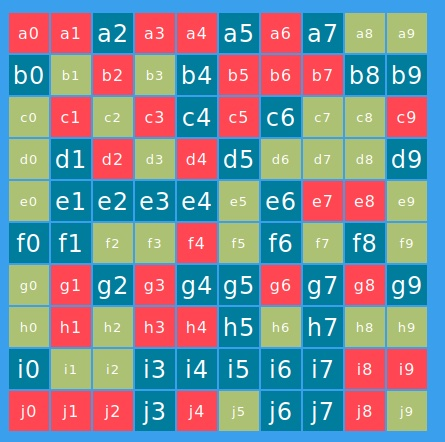

# boxesdemo-nodejs
NodeJS Version of the Boxes Demo


This shows how to user Server-Sent Events (SSE) to send treatment information to the browser. 

This also shows using http API calls back to the NodeJS backend to track events.

download the git repo, you will also need to set the server side API key in an `.env` file (you will have to create it, model it after the .env.example file currently exisitng in this repo)

then do 

```
npm install
```


To run, use
```
node index.js
```

It will create a server on port 3000.


Once you nagivate to the app you'll have a screen that asks for a split name and an optional event name. 



You will need a split with a very specific setup to use this app. 

The following shell script can automatically create the split for you if you have an admin API key. You will need to have `jq` installed.

[Click Here](CreateBoxSplit.sh)

The syntax for running this command can be seen below

```
CreateBoxSplit <workspace name> <environment name> <trafficType name> <newSplitName> <admin_apiKey>
```

(Make sure you use an admin API Key that allows you to create a split for the same environment and workspace that your Server Side SDK Key is for)


Once the split is created, you can use that as the split name and click the **Login** button.

Once logged in you should be able to see updates to the box array in realtime as the dynamic configuration and/or split rollout plan is updated.

